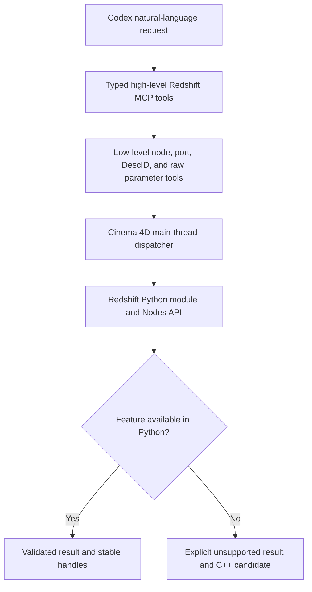

# Redshift Control Foundation Design

**Date:** 2026-08-08  
**Status:** User-approved design  
**Target:** Cinema 4D 2025.3.2 on Windows x64, Redshift renderer `1036219`

## Purpose

Extend the existing Cinema 4D MCP with a dedicated Redshift capability layer. The long-term
objective is to control every Redshift feature exposed through supported Cinema 4D APIs, while
reporting features that require a native C++ bridge instead of pretending that Python can reach
them.

The first milestone proves one complete production path in a disposable document: Redshift
RenderData, PBR material and textures, lights, camera, AOVs, and a small Beauty plus AOV render.
It must preserve the user's original document and leave no temporary scene state behind.

## Current evidence

The installed runtime has been queried through the authenticated MCP bridge:

- Cinema 4D raw version `2025302` (2025.3.2), Python 3.11.4, Windows.
- Bridge 0.4.0 on loopback with token authentication enabled.
- Redshift VideoPost `1036219` and RS post effect `1040189` are detected.
- Node Materials and Scene Nodes are available.
- The Redshift node space is `com.redshift3d.redshift4c4d.class.nodespace`.
- Read-only enumeration returns 161 Redshift node-template asset IDs on this installation.
- Arbitrary `exec_python` remains disabled.

This evidence proves discovery only. It does not prove Redshift graph mutation, AOV mutation, or
Redshift rendering until the strict live suite in this design passes.

## Confirmed product decisions

1. Build a dual-layer interface: high-level production tools plus low-level node and parameter
   controls.
2. Implement the Python capability layer first. Add native C++ only for features proven to be
   inaccessible from Python.
3. Use tiered safety. Ordinary operations may target the active document; destructive replacement,
   clearing, and formal rendering require a unique document name and explicit flags.
4. Live tests may create a uniquely named disposable document, perform a small Redshift render,
   close the document, and restore the original document focus.
5. Promote only behavior exercised by a non-skipped strict live test.

## Scope

### First milestone

- Discover Redshift renderer, module, node-space, AOV, light, camera, and render capabilities.
- Create a Redshift node material.
- Set Base Color, Metalness, Roughness, Normal, and Displacement values or textures.
- Create and update Area, Dome, Sun, Point, and Spot lights when the runtime exposes them.
- Create or update a camera and its accessible Redshift exposure and depth-of-field settings.
- List, create/update, remove, and explicitly clear Redshift AOVs.
- Create or update a Redshift RenderData.
- Render a small Beauty image and report AOV outputs.
- Verify cleanup and original-document restoration in the real Cinema 4D runtime.

### Not in the first milestone

- IPR or RenderView UI control.
- GPU device selection, VRAM management, texture-cache administration, or license UI.
- Proxy, Volume, Hair, Object Tag, advanced motion blur, or the complete Redshift setting catalog.
- A native C++ plugin.
- Compatibility claims for Cinema 4D 2024, 2026, macOS, or a different Redshift build.

These are roadmap items, not implied first-milestone functionality.

## Architecture

### Python handler package

Create `plugin/cinema4d_mcp_bridge/bridge/handlers/redshift/`:

- `_helpers.py`: lazy Redshift import, capability checks, renderer VideoPost lookup, unique document
  resolution, path validation, value conversion, and shared result helpers.
- `capabilities.py`: Redshift-specific runtime feature report.
- `materials.py`: material creation and the first PBR graph writer.
- `lights.py`: supported Redshift light creation and updates.
- `camera.py`: camera creation/update and accessible Redshift camera settings.
- `aovs.py`: AOV listing, upsert, removal, clearing, and rollback snapshots.
- `render.py`: Redshift RenderData configuration, guarded render execution, and output manifest.

The package must not import `redshift` eagerly. A missing module or SDK symbol must leave the base
Cinema 4D bridge operational and produce a feature-specific unsupported response.

### TypeScript tools

Follow the existing one-tool-per-file convention under `src/tools/`. TypeScript validates MCP input
and forwards it to the Python bridge; Cinema 4D and Redshift behavior remains in Python on the main
thread.

### Existing low-level tools

Do not duplicate functionality already provided by:

- `list_graph_node_assets`
- `list_graph_nodes`
- `get_graph_info`
- `apply_graph_description`
- `set_graph_port`
- `remove_graph_node`
- `describe`, `get_params`, and `set_params`

The Redshift tools compose these primitives or add capabilities that cannot be expressed through
them, especially material creation, AOV objects, Redshift lights, and guarded rendering.

## First-milestone tool contracts

### `rs_get_capabilities`

Read-only. Report:

- renderer and VideoPost detection;
- whether the `redshift` module imports;
- node-space availability and node-template count;
- AOV API functions and required constants;
- supported light and camera types/symbols;
- render support;
- per-feature `supported` status and a reason when unavailable.

All mutating tools use the same probes before writing.

### `rs_create_material`

Create a named material with a Redshift node graph and return its canonical material handle and
node-space ID.

- Duplicate names fail by default.
- `update_if_exists:true` reuses one uniquely named material.
- Ambiguous duplicate names always fail.
- The tool does not replace an existing graph.

### `rs_set_material_pbr`

Set the first supported PBR surface on a Redshift material:

- Base Color: RGB value or texture.
- Metalness: scalar or texture.
- Roughness: scalar or texture.
- Normal: texture and strength.
- Displacement: texture and scale.

A texture input contains an absolute existing path plus optional color-space override. Base Color
defaults to color-data handling; Metalness, Roughness, Normal, and Displacement default to raw/data
handling. Values remain overrideable because OCIO configurations differ.

The default behavior updates only supplied channels. `replace_graph:true` requires a unique
`document_name` and explicit confirmation; it validates every texture and node type before replacing
anything.

### `rs_create_light`

Create or uniquely update a Redshift light. The first-milestone type enum is `area`, `dome`, `sun`,
`point`, or `spot`. Inputs include name, transform, color, intensity, exposure, and an optional Dome
texture. A type not exposed by the running build returns unsupported rather than falling back to a
different light. An existing unique name is updated only with `update_if_exists:true`; ambiguous
duplicates always fail.

### `rs_set_camera`

Create or uniquely update a camera and set the accessible Redshift exposure, shutter, focus, and
depth-of-field values. The result identifies which requested settings were applied and which are
unavailable on the current build. A required name creates the camera when absent; a unique existing
camera is updated only with `update_if_exists:true`, and ambiguous duplicates fail. The tool never
substitutes a different parameter silently.

### `rs_list_aovs`

Read-only. Return every Redshift AOV with a stable index for the current snapshot, type, display
name, enabled state, multipass state, direct-file state, path, and all additional parameters the
runtime exposes safely.

### `rs_upsert_aov`

Create or uniquely update one AOV. Accept a supported alias or a raw numeric type, name, enabled
flags, output settings, and an optional raw parameter map. Validate the complete payload before
mutation and return the normalized AOV record.

### `rs_remove_aov`

Remove one uniquely identified AOV by index plus expected name/type, preventing a stale index from
deleting a different AOV. Return the removed record and the remaining count.

### `rs_clear_aovs`

Remove all Redshift AOVs. Requires a unique `document_name` and `force:true`. Return the removed AOV
snapshot. On an exception during clearing, restore the snapshot when the Redshift API permits it and
report whether rollback succeeded.

### `rs_configure_render`

Create or uniquely update RenderData with renderer `1036219`, resolution, frame selection, output
format, Beauty path, multipass path, and supported Redshift settings. It must not change the active
RenderData unless `make_active:true` is passed.

### `rs_render`

Run Redshift for a uniquely named document and RenderData. Require:

- `document_name`;
- `force:true` as explicit confirmation that a synchronous Redshift render may block Cinema 4D;
- an absolute output path with an existing writable parent;
- `overwrite:true` when the destination already exists.

Return a manifest containing Beauty and AOV paths, file sizes, render duration, renderer identity,
warnings, and any outputs that were expected but missing. Never fall back to Standard or Viewport.
The call is synchronous; a client timeout does not claim that Cinema 4D stopped rendering.

## Data flow and state protection

1. Resolve the optional or required document and record the previous active document.
2. Run capability checks and validate all names, types, paths, node IDs, and output destinations.
3. Switch to the target only inside the main-thread dispatch when necessary.
4. Begin an undo or node transaction where the corresponding SDK supports it.
5. Snapshot Redshift AOV or RenderData state before non-transactional mutation.
6. Execute the operation.
7. Verify the target document is still active during each mutation.
8. Restore the previous document in `finally`.
9. Return stable handles, normalized records, output manifests, and explicit warnings.

Ordinary creation and single-value updates may use the active document. Full graph replacement, all-
AOV clearing, bulk replacement, and formal rendering require a unique document name and explicit
flags.

## Validation and error behavior

- Missing Redshift, license/runtime errors, a missing Python module, node-space absence, and missing
  SDK symbols produce specific errors or `supported:false` reports.
- Invalid or relative texture/output paths fail before scene mutation.
- Existing output files fail unless `overwrite:true`.
- Duplicate names fail unless the contract explicitly allows unique update-by-name.
- Unsupported AOV, node, light, or camera types do not fall back to a nearby type.
- Operations that Redshift does not expose to Cinema 4D Undo return `undo_supported:false`.
- A rollback report distinguishes `not_needed`, `succeeded`, `partial`, and `unavailable`.
- The bridge never logs token values or entire untrusted request payloads.

## Testing strategy

### Test-driven implementation

For each tool or helper:

1. Add a focused failing TypeScript or Python test.
2. Confirm that it fails for the intended missing behavior.
3. Add the smallest implementation that passes.
4. Run the focused test, then the complete offline gates.

### Offline Python tests

Use fake `c4d`, `maxon`, and `redshift` modules to cover:

- capability detection with optional symbols missing;
- Redshift module import failure without bridge startup failure;
- material graph inputs and color-space defaults;
- light and camera type/parameter mapping;
- AOV list/upsert/remove/clear and rollback;
- RenderData configuration and no-fallback behavior;
- duplicate names, invalid paths, unsupported types, and zero-write validation failures;
- active-document restoration after success and exceptions.

### TypeScript tests

Cover every public input schema, high-risk required fields, result normalization, tool registration,
and generated documentation.

### Strict live test

Add `npm run test:live:redshift:2025`. It is non-skippable in strict mode and must:

1. Require Cinema 4D 2025.3.2, bridge 0.4.0, loopback, token authentication, and disabled arbitrary
   Python.
2. Require Redshift `1036219`, its Python module, Redshift node space, and AOV API.
3. Snapshot open documents and the active document.
4. Create one uniquely named disposable document without altering the original.
5. Create test geometry, a Redshift PBR material, Area/Dome lights, and a camera.
6. Create a common AOV subset supported by the runtime.
7. Render a 64 by 64 Beauty image plus AOV outputs into a temporary directory.
8. Assert expected files exist and are non-empty.
9. Exercise one rejected invalid texture or AOV request and prove zero unintended mutation.
10. Close the disposable document, delete temporary files, and assert the original document list and
    focus are restored exactly.

If the active user document is blank, the suite refuses before mutation because inserting another
document can destroy Cinema 4D's blank active document. The user can place one disposable object in
that scene before rerunning.

### Release gates

- `npm run build`
- all Python tests
- `npm test` with bridge-dependent suites forced to an unreachable port
- `npm run check`
- `npm audit --audit-level=high`
- `npm run test:live:2025`
- `npm run test:live:redshift:2025`
- installed-plugin source/hash verification
- clean Git status

Only Redshift operations exercised by the strict suite are promoted to live-verified status.

## Roadmap to broad control

1. **Core production path:** this design's material, PBR, light, camera, AOV, RenderData, and render
   milestone.
2. **Advanced materials:** UDIM, Triplanar, Color Correct, Ramp, Bump Blend, advanced displacement,
   SSS, Glass, Emission, Opacity, OSL, templates, and batch texture replacement.
3. **Scene objects and tags:** all accessible Redshift lights, camera parameters, Object Tag,
   Environment, Proxy, Volume, Hair, and motion blur.
4. **Complete render pipeline:** broader AOVs, Light Groups, Cryptomatte, denoise, EXR layers,
   sampling, GI, Takes, and batch renders.
5. **Interactive/system capabilities:** investigate IPR/RenderView, devices, VRAM, caches, presets,
   and queues.
6. **Native C++ supplement:** implement only capabilities proven inaccessible through supported
   Python APIs.

For every detected Redshift feature, the project records exactly one state: high-level tool,
low-level controllable, or unavailable with reason and a possible C++ path.

## Documentation changes

- Regenerate `docs/TOOLS.md` from registered tools.
- Add Redshift examples and security notes to `README.md`.
- Add exact live evidence and unsupported boundaries to `docs/COMPATIBILITY.md`.
- Extend `docs/CODEX_SETUP.md` with the Redshift live-test command and restart requirements.

## References

- Maxon Graph Descriptions Manual, Cinema 4D Python SDK 2025.3.1:
  https://developers.maxon.net/docs/py/2025_3_1/manuals/manual_graphdescription.html
- Maxon Redshift AOV Python example:
  https://developers.maxon.net/forum/topic/12315/how-do-i-access-redshift-aov-settings-from-python
- Maxon Cinema 4D SDK overview and Python/C++ boundary:
  https://developers.maxon.net/forum/topic/15248/cinema-4d-sdk-overview
- OpenAI Codex MCP configuration:
  https://developers.openai.com/codex/mcp
